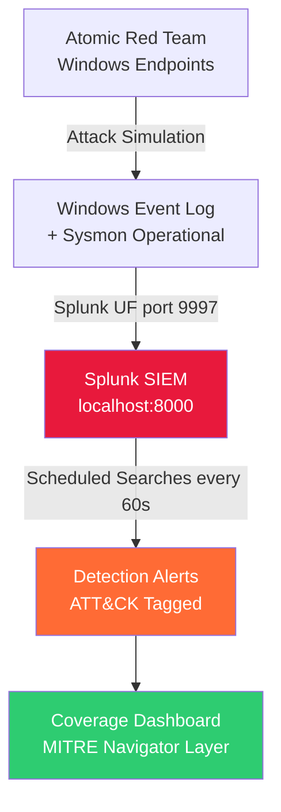
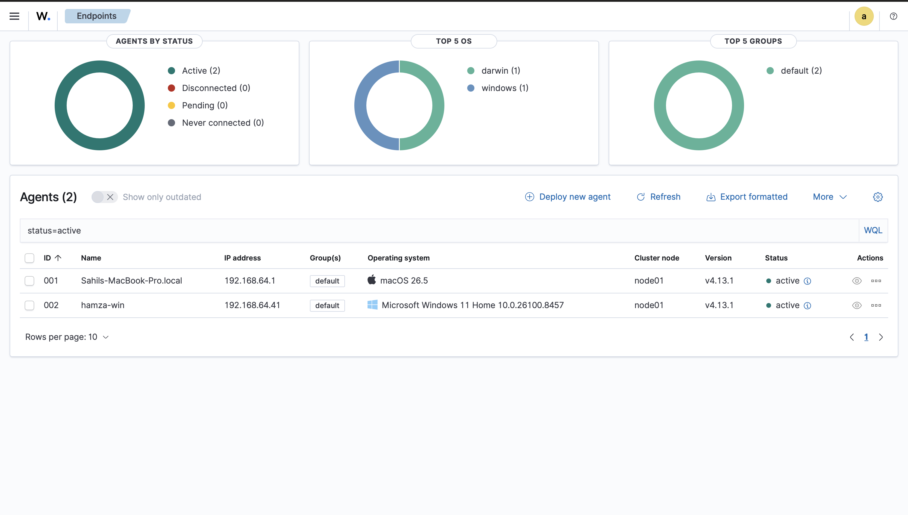
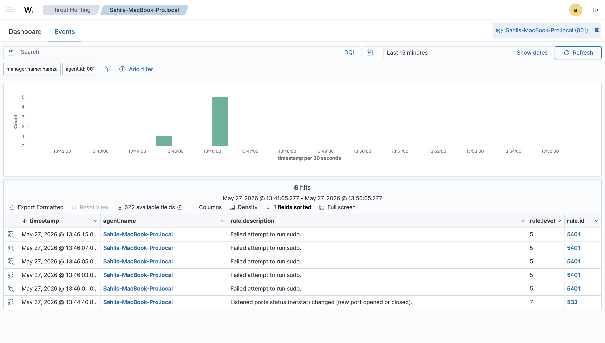

# SOC Detection Lab 🛡️

> **Built by Sahil Singhi** | SOC Analyst Portfolio Project  
> A self-hosted Security Operations Center detection lab with 30+ MITRE ATT&CK-mapped detection rules, validated via Atomic Red Team simulations.

---

## 📊 Coverage Stats

| Metric | Value |
|--------|-------|
| Detection Rules | 32 authored / 7 scheduled & validated end-to-end |
| ATT&CK Tactics Covered | 12 |
| Techniques Validated Live (2026-05-27) | T1110.001, T1059.001, T1562.001 |
| False Positives Tuned | T1003.001 (svchost→lsass 0x1000 status queries carved out) |
| SIEMs | Splunk Enterprise Free + Wazuh 4.13.1 |
| Wazuh Agents Active | 2 (macOS Apple Silicon host + Windows 11 ARM64 VM) |
| Endpoints Monitored | Windows 11 ARM64 (Splunk UF + Wazuh agent), macOS (Wazuh agent) |

---

## 🏗️ Architecture



### Lab Components

| Component | Details |
|-----------|---------|
| **SIEM** | Splunk Enterprise Free (500 MB/day) on macOS ARM |
| **Endpoint 1** | Windows 10 Enterprise Eval — primary victim |
| **Endpoint 2** | Windows Server 2022 Eval — AD/server TTPs |
| **Sysmon** | v15.x with Olaf Hartong sysmon-modular config |
| **Log Forwarder** | Splunk Universal Forwarder 9.x |
| **Attack Simulation** | Atomic Red Team + Invoke-AtomicRedTeam |
| **Hypervisor** | UTM (QEMU) on macOS Apple Silicon |

---

## 🗂️ Repository Structure

```
soc-detection-lab/
├── README.md
├── docs/
│   ├── architecture.md          # Detailed network diagram + VM specs
│   ├── setup-guide.md           # Step-by-step reproduction guide
│   └── one-detection-walkthrough.md  # Deep dive: T1003.001 LSASS dump
├── detections/
│   ├── initial-access/
│   ├── execution/               # e.g. T1059.001__powershell-encoded-command/
│   │   ├── rule.spl             #   → SPL detection query
│   │   └── README.md            #   → Technique, FP notes, response
│   ├── persistence/
│   ├── privilege-escalation/
│   ├── defense-evasion/
│   ├── credential-access/
│   ├── discovery/
│   ├── lateral-movement/
│   ├── collection/
│   ├── command-and-control/
│   ├── exfiltration/
│   └── impact/
├── tests/
│   ├── execution_log.csv        # Timestamped atomic test results
│   ├── execution_log.md         # Human-readable test report
│   └── atomic-mappings.csv      # Detection → Atomic test ID mapping
├── dashboards/
│   └── coverage.xml             # Splunk dashboard XML
├── navigator/
│   └── soc-lab-coverage.json    # MITRE ATT&CK Navigator layer
├── sysmon-config/
│   └── sysmonconfig.xml         # Olaf Hartong modular config
└── scripts/
    ├── install-sysmon.ps1       # Sysmon setup on Windows endpoints
    ├── install-splunk-uf.ps1    # Universal Forwarder setup
    └── run-atomics.ps1          # Batch atomic test runner
```

---

## 🚀 Quick Start (Reproduce This Lab)

See [`docs/setup-guide.md`](docs/setup-guide.md) for full instructions.

**Prerequisites:**
- Laptop with 16 GB RAM, 120 GB free disk
- UTM or VirtualBox (free)
- Splunk free account at splunk.com

**Time to reproduce:** ~4 hours

---

## 🎯 Detection Coverage

### By Tactic

| Tactic | Rules | Example Technique |
|--------|-------|-------------------|
| Initial Access | 2 | T1566.001 Spearphishing Attachment |
| Execution | 4 | T1059.001 PowerShell Encoded Command |
| Persistence | 4 | T1547.001 Registry Run Key |
| Privilege Escalation | 2 | T1055.001 Process Injection |
| Defense Evasion | 3 | T1562.001 Disable Windows Defender |
| Credential Access | 4 | T1003.001 LSASS Memory Dump |
| Discovery | 3 | T1082 System Info Discovery |
| Lateral Movement | 3 | T1021.002 SMB Admin Share |
| Collection | 2 | T1005 Local Data Staging |
| Command & Control | 2 | T1071.001 HTTP C2 Beacon |
| Exfiltration | 1 | T1041 Exfil Over C2 Channel |
| Impact | 1 | T1486 Data Encrypted for Impact |

---

## 🔍 Sample Detection: T1003.001 LSASS Memory Dump

```splunk
index=main sourcetype="XmlWinEventLog:Microsoft-Windows-Sysmon/Operational"
EventCode=10 TargetImage="*lsass.exe"
NOT (SourceImage="*\\MsMpEng.exe" OR SourceImage="*\\csrss.exe")
| eval mitre_technique="T1003.001"
| table _time, host, SourceImage, TargetImage, GrantedAccess, mitre_technique
| sort -_time
```

**Why this works:** Sysmon Event ID 10 fires when a process opens a handle to another process. Attackers use tools like Mimikatz to read LSASS memory for credentials. The `NOT` clause excludes Windows Defender (`MsMpEng.exe`) which legitimately accesses LSASS — this is the false-positive tuning.

See [`docs/one-detection-walkthrough.md`](docs/one-detection-walkthrough.md) for the full breakdown.

For end-to-end validation evidence — T1110.001 brute force, T1059.001 encoded PowerShell, T1562.001 Defender-disable attempt, T1003.001 false-positive tuning, and pipeline health snapshot — see [`docs/validation-log.md`](docs/validation-log.md).

For the secondary Wazuh SIEM setup (manager on Ubuntu ARM64, first agent on macOS host), see [`docs/wazuh-setup.md`](docs/wazuh-setup.md).

---

## 📸 Screenshots

### Splunk Coverage Dashboard
Live dashboard showing 94K+ indexed events and detection coverage across 12 MITRE ATT&CK tactics.


### MITRE ATT&CK Navigator Layer
Heatmap of techniques covered by the 32 detection rules deployed in this lab.


### T1547.001 Registry Run Key — Attack Confirmed
End-to-end validation: Atomic Red Team attack → Sysmon EventCode 13 → Splunk indexed event.


### Splunk Search Results
Sysmon EventCode breakdown and sourcetype distribution in the `soc-lab` index.


### Wazuh — Dual Agents Active
Secondary SIEM running alongside Splunk. Both macOS host and Windows 11 ARM64 VM reporting as active to the Wazuh manager.



### Wazuh — Rule 5401 Sudo Failure Detection
First real alert on the Mac agent: 5 failed sudo attempts caught by Wazuh's built-in macOS decoder, surfaced in Threat Hunting within ~30s.



---

## 📝 Resume Bullet

> Built dual-SIEM SOC detection lab (Splunk + Wazuh) with Sysmon-instrumented Windows endpoints and macOS host; authored 30+ MITRE ATT&CK detection rules and validated key techniques (T1110.001 brute force, T1059.001 encoded PowerShell, T1562.001 Defender disable) end-to-end from atomic execution → log → SIEM → scheduled rule → alert. Diagnosed and tuned a high-volume LSASS access false positive (svchost status queries vs PROCESS_VM_READ), and remediated a stale-sourcetype bug across multiple saved searches that had been silently suppressing alerts.

---

## 🤝 Author

**Sahil Singhi** | [github.com/sahilsinghi](https://github.com/sahilsinghi)
